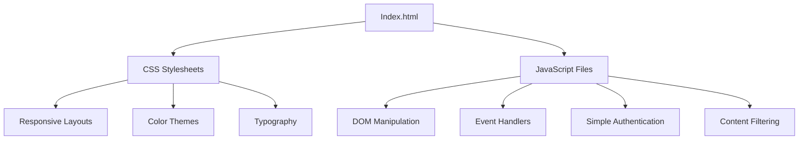

# Design Document: Junior Current Website

## Overview

This design document outlines the architecture, components, and implementation details for the Junior Current girls soccer team website. The website will be built using HTML, CSS, and JavaScript to ensure compatibility with GitHub Pages hosting. The design follows a mobile-first approach with responsive layouts that adapt to different screen sizes while maintaining the KC Current-inspired color palette and design elements.

## Architecture

The website will follow a simple static site architecture with client-side rendering:



### File Structure

```
junior-current-website/
├── index.html              # Home page
├── roster.html             # Roster page
├── schedule.html           # Schedule page
├── awards.html             # Awards page
├── coaches.html            # Coaches page
├── about.html              # About page
├── login.html              # Login page
├── admin.html              # Admin page (protected)
├── css/
│   ├── styles.css          # Main stylesheet
│   ├── responsive.css      # Responsive design rules
│   └── admin.css           # Admin panel styles
├── js/
│   ├── main.js             # Main JavaScript functionality
│   ├── navigation.js       # Navigation behavior
│   ├── schedule.js         # Schedule filtering logic
│   ├── auth.js             # Simple authentication
│   └── admin.js            # Admin panel functionality
└── images/
    ├── logo.png            # Team logo
    ├── bannerpic.jpg       # Banner image
    └── players/            # Player photos
```

## Components and Interfaces

### 1. Navigation Component

The navigation component will be a sticky header that remains visible as users scroll through the site.

```html
<nav class="main-nav">
  <div class="logo-container">
    
  </div>
  <button class="mobile-menu-toggle" aria-label="Toggle menu">
    <span class="hamburger"></span>
  </button>
  <ul class="nav-links">
    <li><a href="index.html">Home</a></li>
    <li><a href="roster.html">Roster</a></li>
    <li><a href="schedule.html">Schedule</a></li>
    <li><a href="awards.html">Awards</a></li>
    <li><a href="coaches.html">Coaches</a></li>
    <li><a href="login.html">Login</a></li>
  </ul>
</nav>
```

### 2. Footer Component

The footer will be consistent across all pages and include the team's tagline.

```html
<footer class="site-footer">
  <div class="footer-content">
    <p>Junior Current | Powered by Passion | Spring 2025</p>
  </div>
</footer>
```

### 3. Player Card Component

Player cards will display player information in a visually appealing format.

```html
<div class="player-card">
  <div class="player-image">
    
  </div>
  <div class="player-info">
    <h3 class="player-name">Player Name</h3>
    <p class="player-position">Position / Secondary Position</p>
    <p class="player-description">Player description text here...</p>
  </div>
</div>
```

### 4. Award Card Component

Award cards will highlight player achievements using the KC Current color palette.

```html
<div class="award-card">
  <div class="award-title">Award Name</div>
  <div class="award-recipient">Player Name</div>
  <div class="award-description">Short description of the award</div>
</div>
```

### 5. Schedule Component

The schedule component will display game information with filtering capabilities.

```html
<div class="schedule-container">
  <div class="schedule-filters">
    <button class="filter-btn active" data-filter="all">All</button>
    <button class="filter-btn" data-filter="past">Past</button>
    <button class="filter-btn" data-filter="upcoming">Upcoming</button>
  </div>
  
  <div class="schedule-table">
    <!-- Schedule entries will be rendered here -->
  </div>
</div>
```

### 6. Login Form Component

A simple login form for administrative access.

```html
<form class="login-form">
  <div class="form-group">
    <label for="email">Email</label>
    <input type="email" id="email" required>
  </div>
  <div class="form-group">
    <label for="password">Password</label>
    <input type="password" id="password" required>
  </div>
  <button type="submit" class="btn btn-primary">Login</button>
</form>
```

## Data Models

### 1. Player Model

```javascript
const playerModel = {
  name: String,         // Player's name
  position: String,     // Primary position
  secondaryPosition: String, // Secondary position
  description: String,  // Character description
  photoUrl: String      // Path to player's photo
};
```

### 2. Game Model

```javascript
const gameModel = {
  date: String,         // Game date
  opponent: String,     // Opponent team name
  time: String,         // Game time
  location: String,     // Game location
  result: String,       // "Win", "Loss", "Tie", or null for upcoming games
  score: String,        // Score (e.g., "2-1")
  isExhibition: Boolean // Whether the game is an exhibition match
};
```

### 3. Award Model

```javascript
const awardModel = {
  title: String,        // Award title
  recipient: String,    // Player who received the award
  description: String   // Short description of the award
};
```

### 4. Coach Model

```javascript
const coachModel = {
  name: String,         // Coach's name
  role: String,         // Optional role description
  photoUrl: String      // Optional path to coach's photo
};
```

### 5. User Model (for Authentication)

```javascript
const userModel = {
  email: String,        // Admin email
  password: String,     // Hashed password (for demo purposes only)
  isAuthenticated: Boolean // Authentication status
};
```

## Color Palette and Typography

### Colors

The website will use the KC Current color palette as specified in the requirements:

```css
:root {
  --navy-blue: #0c223f;      /* Background and outlines */
  --light-teal: #6dd2dc;     /* Side panels and stars */
  --red: #d61f26;            /* Central stripe */
  --white: #ffffff;          /* Text and stars */
  --dark-teal: #0e3c4e;      /* Accents within the teal side */
  --very-dark-navy: #0a1a2e; /* Shadows/outlines */
}
```

### Typography

The website will use a modern, clean font stack that emphasizes readability:

```css
body {
  font-family: 'Montserrat', 'Roboto', sans-serif;
}

h1, h2, h3, h4, h5, h6 {
  font-family: 'Montserrat', 'Roboto', sans-serif;
  font-weight: 700;
}
```

## Responsive Design

The website will follow a mobile-first approach with breakpoints for different device sizes:

```css
/* Base styles for mobile */
.container {
  width: 100%;
  padding: 0 15px;
}

/* Tablet (768px and up) */
@media (min-width: 768px) {
  .container {
    max-width: 720px;
    margin: 0 auto;
  }
  
  .player-cards {
    display: grid;
    grid-template-columns: repeat(2, 1fr);
    gap: 20px;
  }
}

/* Desktop (992px and up) */
@media (min-width: 992px) {
  .container {
    max-width: 960px;
  }
  
  .player-cards {
    grid-template-columns: repeat(3, 1fr);
  }
}

/* Large Desktop (1200px and up) */
@media (min-width: 1200px) {
  .container {
    max-width: 1140px;
  }
  
  .player-cards {
    grid-template-columns: repeat(4, 1fr);
  }
}
```

## Page Layouts

### Home Page Layout

```
+----------------------------------+
|           Navigation             |
+----------------------------------+
|                                  |
|           Banner Image           |
|                                  |
+----------------------------------+
|                                  |
|           Page Title             |
|           Subheading             |
|                                  |
+----------------------------------+
|                                  |
|           Team Record            |
|                                  |
+----------------------------------+
|                                  |
|           Team Narrative         |
|                                  |
+----------------------------------+
|                                  |
|           CTA Button             |
|                                  |
+----------------------------------+
|              Footer              |
+----------------------------------+
```

### Roster Page Layout

```
+----------------------------------+
|           Navigation             |
+----------------------------------+
|                                  |
|           Page Title             |
|                                  |
+----------------------------------+
|                                  |
|           Player Cards           |
|           (Grid Layout)          |
|                                  |
|                                  |
|                                  |
|                                  |
+----------------------------------+
|              Footer              |
+----------------------------------+
```

### Schedule Page Layout

```
+----------------------------------+
|           Navigation             |
+----------------------------------+
|                                  |
|           Page Title             |
|                                  |
+----------------------------------+
|                                  |
|           Filter Buttons         |
|                                  |
+----------------------------------+
|                                  |
|           Schedule Table         |
|           or Card Grid           |
|                                  |
|                                  |
+----------------------------------+
|              Footer              |
+----------------------------------+
```

## Error Handling

### Form Validation

Client-side form validation will be implemented for the login form:

```javascript
document.querySelector('.login-form').addEventListener('submit', function(e) {
  e.preventDefault();
  
  const email = document.getElementById('email').value;
  const password = document.getElementById('password').value;
  
  if (!email || !password) {
    showError('Please enter both email and password');
    return;
  }
  
  // Simple authentication for demo purposes
  authenticateUser(email, password);
});

function showError(message) {
  const errorElement = document.createElement('div');
  errorElement.className = 'error-message';
  errorElement.textContent = message;
  
  const form = document.querySelector('.login-form');
  form.prepend(errorElement);
  
  // Remove error after 3 seconds
  setTimeout(() => {
    errorElement.remove();
  }, 3000);
}
```

### Image Loading Errors

Handle image loading errors to maintain visual consistency:

```javascript
document.querySelectorAll('img').forEach(img => {
  img.onerror = function() {
    this.src = 'images/placeholder.png';
    this.alt = 'Image not available';
  };
});
```

## Authentication Implementation

Since the website will be hosted on GitHub Pages (static hosting), we'll implement a simple client-side authentication mechanism for demonstration purposes:

```javascript
// auth.js
function authenticateUser(email, password) {
  // For demo purposes only - in a real application, this would be a server call
  const validEmail = 'admin@juniorcurrent.com';
  const validPassword = 'demo123';
  
  if (email === validEmail && password === validPassword) {
    // Store authentication state in sessionStorage
    sessionStorage.setItem('isAuthenticated', 'true');
    window.location.href = 'admin.html';
  } else {
    showError('Invalid email or password');
  }
}

function checkAuthentication() {
  const isAuthenticated = sessionStorage.getItem('isAuthenticated') === 'true';
  
  // Redirect to login if not authenticated and trying to access admin page
  if (!isAuthenticated && window.location.pathname.includes('admin.html')) {
    window.location.href = 'login.html';
  }
}

// Run authentication check on admin page load
document.addEventListener('DOMContentLoaded', checkAuthentication);
```

## Testing Strategy

### Cross-Browser Testing

The website will be tested on the following browsers:
- Chrome (latest version)
- Firefox (latest version)
- Safari (latest version)
- Edge (latest version)

### Responsive Testing

The website will be tested on various device sizes:
- Mobile phones (320px - 480px)
- Tablets (768px - 1024px)
- Desktops (1024px and above)

### Accessibility Testing

The website will be tested for accessibility compliance:
- Screen reader compatibility
- Keyboard navigation
- Color contrast ratios
- Alt text for images

### Performance Testing

The website will be tested for performance:
- Page load times
- Image optimization
- CSS and JavaScript minification

## Implementation Notes

1. **Mobile Navigation**: The mobile navigation will use a hamburger menu that expands/collapses when clicked.

2. **Image Optimization**: All player and game photos will be optimized for web to ensure fast loading times.

3. **Schedule Filtering**: The schedule filtering will be implemented using JavaScript to show/hide elements based on the selected filter.

4. **Admin Functionality**: Since GitHub Pages doesn't support server-side processing, the admin functionality will be limited to client-side demonstrations.

5. **Data Storage**: For demonstration purposes, player data, schedule information, and other content will be stored in JavaScript objects within the respective script files.

6. **Accessibility**: All interactive elements will have appropriate ARIA attributes and keyboard support.

7. **CSS Organization**: CSS will be organized using a component-based approach with separate files for major components and responsive rules.